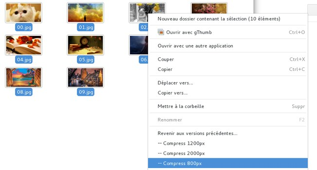

# Recompress images nautilus action

Quickly resize multiple jpeg images to a subfolder

## Installation

### Install prerequires

Install `nautilus actions`, `ruby`, `docopt for Ruby`, `zenity`, `imagemagick` (for `convert` command) and `jpegoptim`

#### On Debian:
    aptitude install nautilus-actions ruby rubygems zenity imagemagick jpegoptim
    gem install docopt

### Copy files

Copy all files somewhere on a local folder

### Import nautilus actions

  * install nautilus-extensions
  * lunch `nautilus-actions-config-tool`
  * drag & drop `desktop_files` dir files onto nautilus-actions-config-tool

### Adapt actions

For each action, in command tab, adapt command with correct path to files
